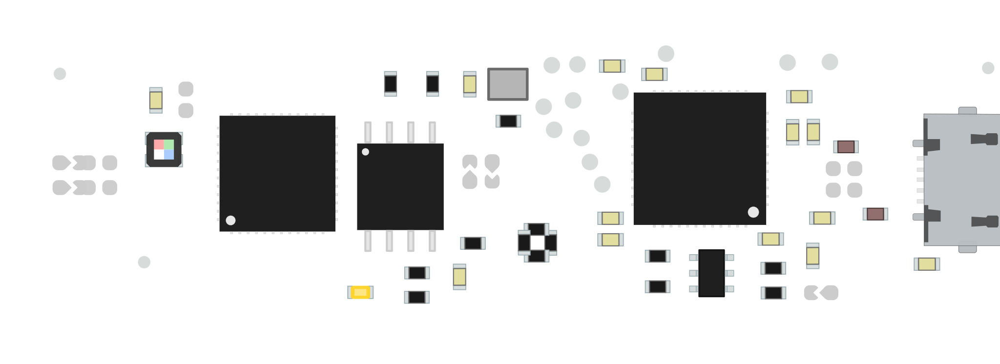

# upduino-pinout

Board with no components:


Board with components and pin headers:


Board with components and no pin headers:



Board labeled with pinout:


## Modifying

Create the board image using [PcbDraw](https://github.com/yaqwsx/PcbDraw) and [PcbDraw-Lib](https://github.com/yaqwsx/PcbDraw-Lib/). Requires that KiCAD is installed:
```
pcbdraw UPduino_v3.0.kicad_pcb board.svg
```

The pins in the pinout diagram can be modified by changing `create_board.py`. The colors / theme of the diagram can be modified by changing `board_diagram.css`.

Create the pinout diagram by using [pinout](https://github.com/j0ono0/pinout):
```
./create_board.py
```
